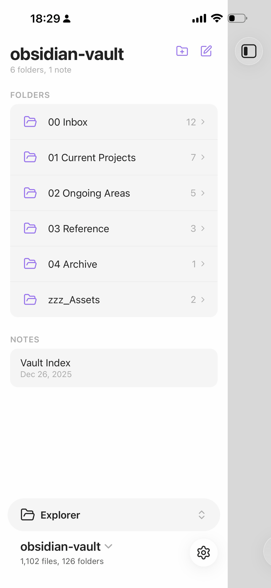
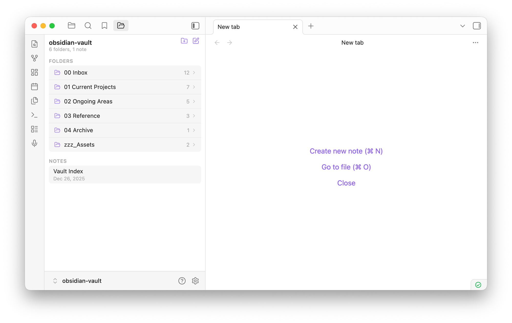

# Mobile Explorer

Replace the default Obsidian file explorer with an Apple Notes-style drill-down navigator. Tap a folder to push into it, swipe or tap back to return. Works on both mobile and desktop.

## Screenshots

| Mobile | Desktop |
|--------|---------|
|  |  |

## Features

- **Drill-down navigation** — tap a folder to push into it, back button or swipe to return
- **Grouped sections** — folders and notes displayed in separate card groups
- **File metadata** — notes show relative modification dates (Today, Yesterday, Jan 4, etc.)
- **Item counts** — folder and note counts in the header, child counts on each folder
- **Native context menu** — right-click (desktop) or long press (mobile) for the full Obsidian file menu
- **Swipe-back gesture** — swipe right to navigate to the parent folder on mobile
- **Slide animations** — iOS-style push/pop transitions between folders
- **Responsive sizing** — compact layout on desktop, touch-optimized on mobile

## Installation

### From Obsidian community plugins

Search for "Mobile Explorer" in Settings > Community plugins > Browse.

### With BRAT (beta testing)

1. Install [BRAT](https://github.com/TfTHacker/obsidian42-brat) from community plugins
2. In BRAT settings, add beta plugin: `marcpanu/obsidian-mobile-explorer`

### Manual

Copy `main.js`, `manifest.json`, and `styles.css` into your vault at `.obsidian/plugins/mobile-explorer/`.

## License

[MIT](LICENSE)
